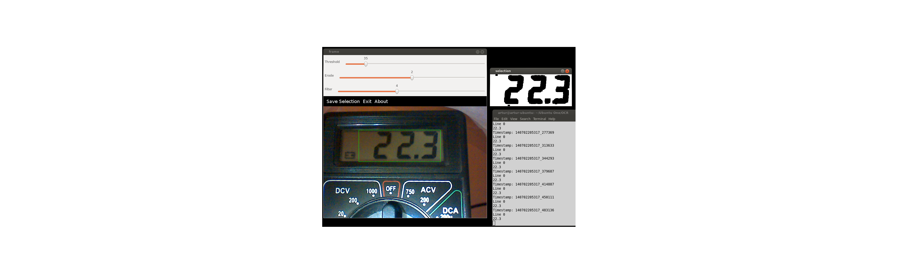

Display OCR
===========

Unmaintained. Alternative traineddata avaliable at [https://github.com/Shreeshrii/tessdata_ssd](https://github.com/Shreeshrii/tessdata_ssd) or alternative implementation that don't use tesseract: [https://github.com/arturaugusto/7seg-ocr](https://github.com/arturaugusto/7seg-ocr).

---

OpenCV-Python + python-tesseract real-time image preprocess and OCR.

Trained data for 7 segments font avaliable under letsgodigital folder.

Web-app using trained data: http://ocr.sytes.net (Not always up, due to the low cost server)

Reference: https://code.google.com/p/python-tesseract/

Tips to achieve better results:
  - Use erode to avoid gaps between the segments.
  - Avoid direct light on the display (I use parchment paper to diffuse the light)

License: GPL v2
